ifdef::env-github[]
:tip-caption: :bulb:
:note-caption: :information_source:
:important-caption: :heavy_exclamation_mark:
:caution-caption: :fire:
:warning-caption: :warning:
endif::[]

= CDF Hands On Workshop

In this workshop you'll implement a data pipeline, using MiNiFi and NiFi to ingest data from an IoT device into Kafka and then consume data from Kafka and write it to Kudu tables.

== Configurations

Before we start, let's take a look at some pre-configuration already setup for the purpose of this workshop:

*DO NOT MAKE ANY CHANGES ON THOSE CONFIGURATIONS*

. *NiFi Registry*: a couple of  Bucket is already setup in  _NiFi Registry_, so that all versions of your flows are stored for review and audit. Open the NiFi Registry at `\http://<public_dns>:18080/nifi-registry`, click on the wrench/spanner icon (image:images/spanner_icon.png[width=20]) on the top-right corner on and make sure a bucket called `IoT` (for MiNiFi flows) and `SensorFlows` (for NiFi flows) are already created.
+
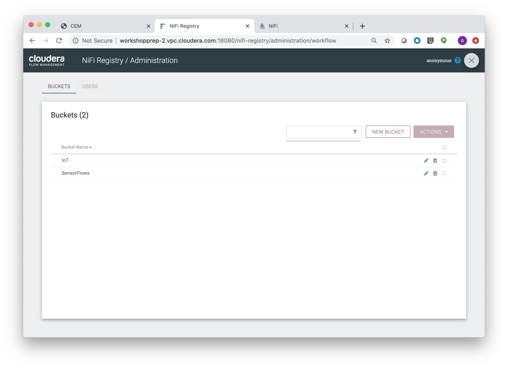

. *NiFi Flows Version Control*: We want to be able to version control the flows we will add to NiFi. In order to do that, we first need to check if NiFi is connected to the *NiFi Registry*. On the NiFi global menu, click on "Controller Settings", to open configuration window.
+
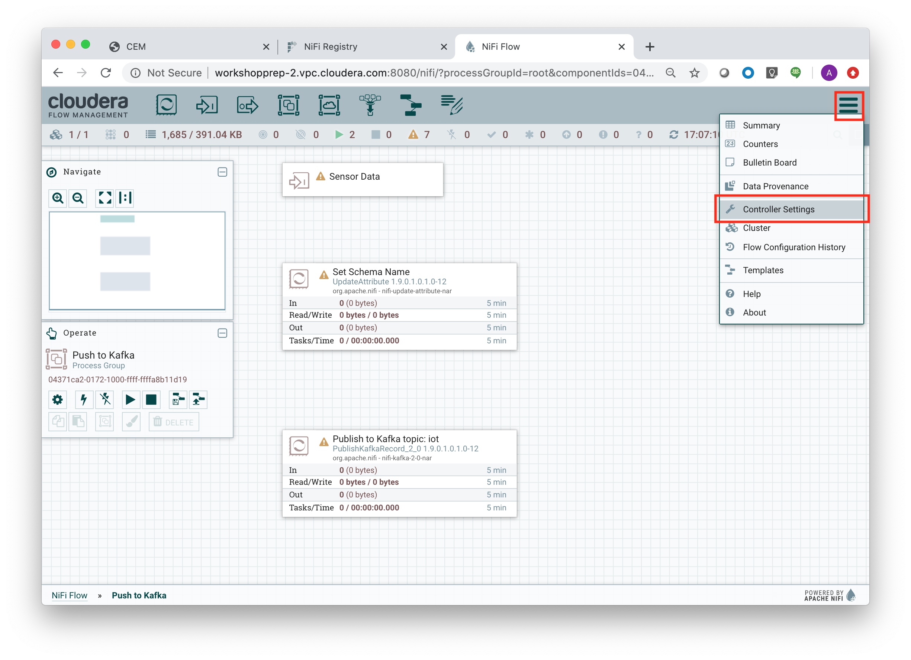
+
Navigate to the "Registry Clients" tab and make sure a Registry client is configured with the following URL:
+
----
Name: NiFi Registry
URL:  http://edge2ai-1.dim.local:18080
----
+
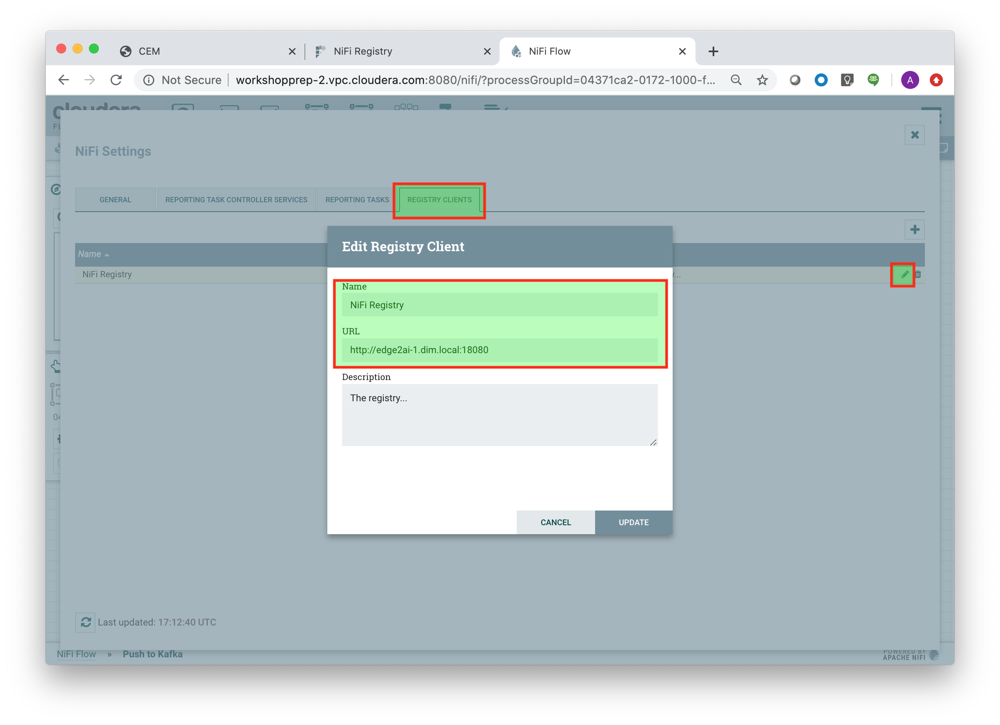
+
. *NiFi Controllers*: Controller Services are shared services that can be used by reporting tasks, processors, and other services to utilize for configuration or task execution. Several controllers are already configured for lab execution. Right-click on the main canvas and select _Configure_ option.
+
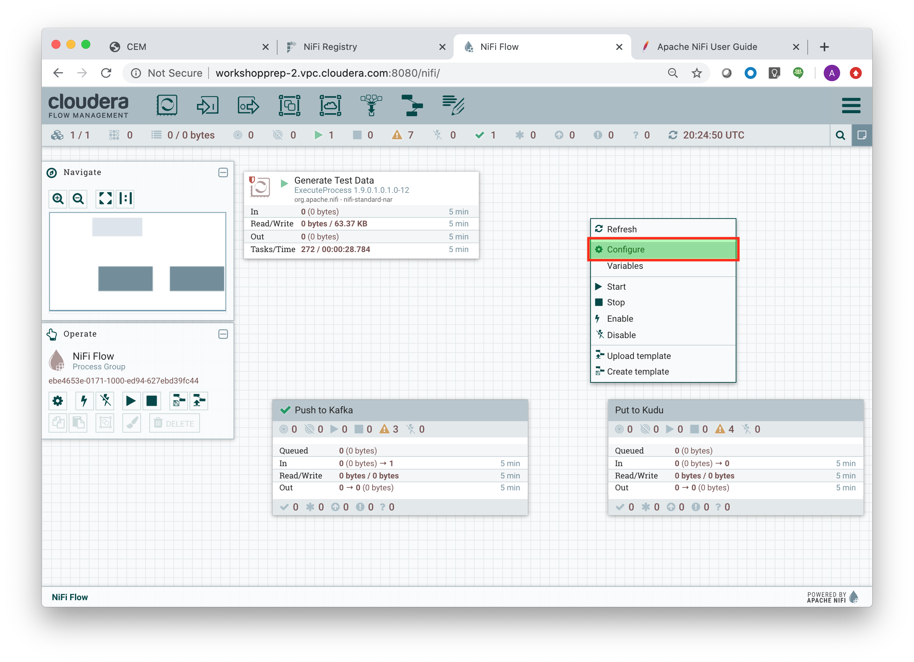
+
A new window will open, listing configured controllers. Go to _Controller Services_ tab.
+
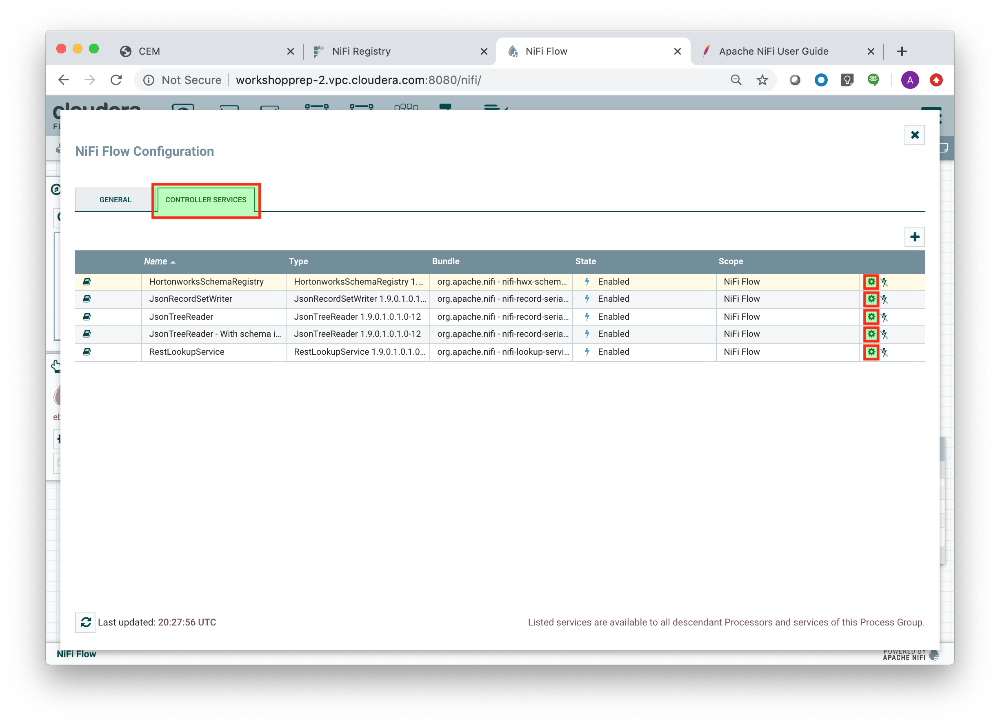
+
You can review any of those Controllers configurations by clicking on the service's _cog_ icon (image:images/cog_icon.png[width=20]) and go to the *Properties* tab. Here is how we are going to use them during the labs:

.. *HortonworkSchemaRegistry*: allows interaction with a schema repository, and reuse those schemas in NiFi flows.
.. *JsonRecordSetWriter*: allows NiFi to write records from the flows in JSON format.
.. *JsonTreeReader*: allows NiFi to understand the format of the input event data (based on a schema), in this case JSON format, and parse them into individual records. Use a `${schema.name}` attribute to identify schema's name.
.. *JsonTreeReader - With schema identifier*: similar to the previous one, but instead of use `${schema.name}` attribute, will use the schema properties in the header.
.. *RestLookupService*: controller service to perform the calls to the CDSW model API endpoint, where a Machine Learning model is exposed to perform real time scoring.

== Labs summary

* <<lab_1>> - On the Apache NiFi, run a simulator to send IoT sensors data to the MQTT broker.
* <<lab_2>> - Create the MiNiFi flow on the Edge Flow Manager and publish it for the MiNiFi agent to start sending data to the NiFi cluster.
* <<lab_3>> - On Schema Registry, review the schema describing the data generated by the IoT sensors.
* <<lab_4>> - On the NiFi cluster, prepare the data and send it to the **Kafka** cluster.
* <<lab_5>> - On the *Streams Messaging Manager (SMM)* Web UI, monitor the Kafka cluster and confirm data is being ingested correctly.
* <<lab_6>> - Use the Edge Flow Manager to update existing edge flows and perform additional processing on the edge
* <<lab_7>> - Use NiFi to process each record, calling the **Model endpoint** and save results to **Kudu**.
* <<lab_8>> - Check the data on Kudu.

[[lab_1, Lab 1]]
== Lab 1 - Apache NiFi: run machine sensors simulator

In this lab you will run a simple Python script that simulates IoT sensor data from some hypothetical machines, and send the data to a MQTT broker (link:https://mosquitto.org/[mosquitto]). The gateway host is connected to many and different type of sensors, but they generally all share the same transport protocol, "mqtt".

. Go to Apache NiFi and find in the canvas a Processor called "Generate Test Data". Take a look at the properties already set on the *PROPERTIES* tab:
+
[source]
----
Command:           python3
Command Arguments: /opt/demo/simulate.py
----
+
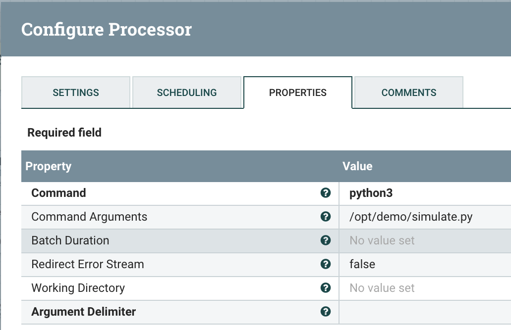

. You can then right-click to *Start* this simulator runner.
+
image::images/nifiDemoStart.png[width=400]

. Right-click and select *Stop* after a few seconds and look at the *provenance*, by clicking at "View data provenance" option. You'll see that it has run a number of times and produced results.
+
image::images/NiFiViewDataProvenance.png[width=400]
+
List of Provenance Events related to "Generate Test Data" processor.
+
image::images/NiFiDataProvenance.png[width=800]
+
Click in the _i_ icon in the first column to review a *Provenance Event*. Once in the window, go to *CONTENT* tab and click on *VIEW* button to review event data.
+
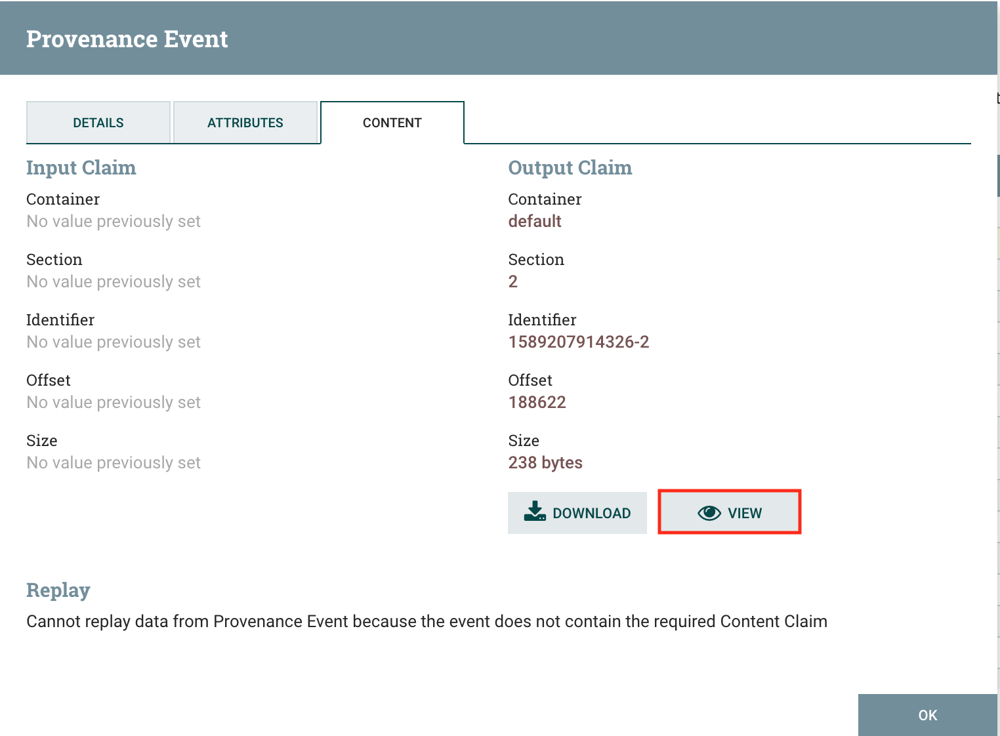
+
Go back to the main NiFi canvas by closing event data, NiFi Data Provenance and Provenance event windows.

[[lab_2, Lab 2]]
== Lab 2 - Configuring Edge Flow Management

Cloudera Edge Flow Management gives you a visual overview of all MiNiFi agents in your environment, and allows you to update the flow configuration for each one, with versioning control thanks to the **NiFi Registry** integration. In this lab, you will create the MiNiFi flow and publish it for the MiNiFi agent to pick it up.

. Open the EFM Web UI at http://<public_dns>:10080/efm/ui/. Ensure you see your minifi agent's heartbeat messages in the **Events Monitor**. Click on the info icon on a heartbeat record to see the details of the heartbeat.
+
image::images/cem_heartbeats.png[width=800]

. You can then select the **Flow Designer** tab (image:images/flow_designer_icon.png[width=30]). To build a dataflow, select the desired class (`iot-1`) from the table and click *OPEN*.  Alternatively, you can double-click on the desired class.

. We already pre-configured some processors for you. Take a look at the  _ConsumeMQTT_ process configurations to consume data from the MQTT broker.
+
[source]
----
Broker URI:     tcp://edge2ai-1.dim.local:1883
Client ID:      minifi-iot
Topic Filter:   iot/#
Max Queue Size: 60
----
+
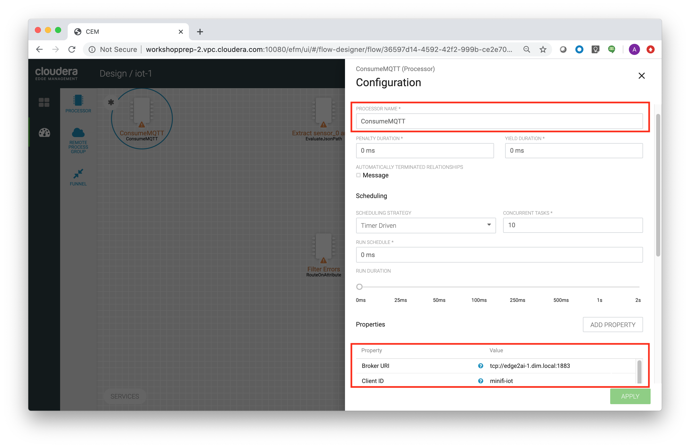
+
Scroll down on the properties page to review the *Topic Filter* and *Max Queue Size* configurations:
+
image::images/add_consumer_mqtt_2.png[width=800]
+
*DO NOT MAKE ANY CHANGES ON THOSE CONFIGURATIONS*
+
. Add a _Remote Process Group_ (RPG) to the canvas and configure it as follows:
+
[source]
----
URL:                http://edge2ai-1.dim.local:8080/nifi
Transport Protocol: HTTP
----
+
image::images/add_rpg.png[width=800]

. At this point you need to connect the ConsumerMQTT processor to the RPG. For this, you first need to add an Input Port to the remote NiFi server. Open the NiFi Web UI at `\http://<public_dns>:8080/nifi/` and drag the _Input Port_ to the canvas. Call it something like "from Gateway".
+
image::images/add_input_port.png[width=800]

. Connect the Input Port to the *Push to Kakfa* Process Group by dragging the destination of the current connection from the *Iput Port* to the Process Group.

+
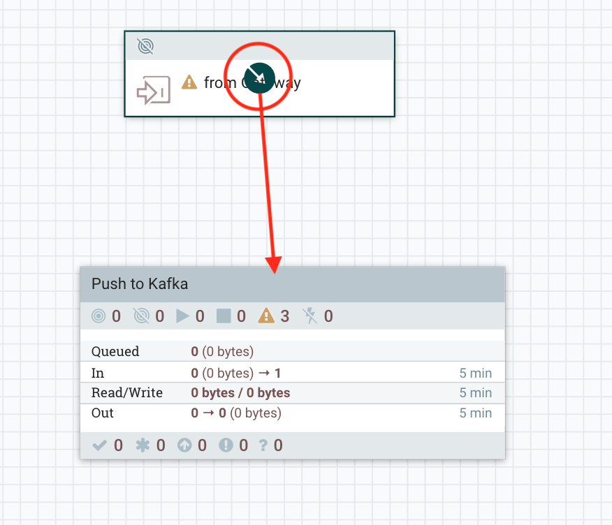
+
When prompted, ensure the "To input" fields is set to the *Sensor data* Input Port, that is located inside the process group. Click  *Apply*  to finish the connection.
+
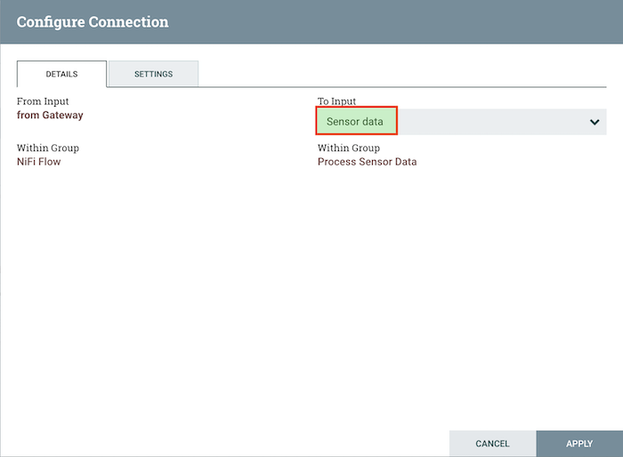

. Right-click on the Input Port and start it. Alternatively, click on the Input Port to select it and then press the start ("play") button on the Operate panel:
+
image::images/operate_panel.png[width=300]

. You will need the ID of the _Input Port_ to complete the connection of the _ConsumeMQTT_ processor to the RPG (NiFi). Double-click on the _Input Port_ and copy its ID.
+
image::images/input_port_id.png[width=800]
+
. Back to the Flow Designer, connect the ConsumeMQTT processor to the RPG. The connection requires an ID and you can paste here the ID you copied from the Input Port. *Make sure that there are NO SPACES*!
+
image::images/connect_to_rpg.png[width=800]
+

Double-click the connection to check the configuration:
+
image::images/efmSetCloudConfiguration.png[width=400]
+
. You can now publish the flow for the MiNiFi agent to automatically pick up. We are using the `IoT` bucket already created in NiFi Registry. Click *Publish*, add a descriptive comment for your changes and click *Apply*.
+
image::images/publish_flow.png[width=800]
+
image::images/cem_first_version.png[width=800]

. Go to the *NiFi Registry* Web UI and refresh the page. If the flow publishing was successful, you should see the flow's version details in the NiFi Registry.
+
image::images/flow_in_nifi_registry.png[width=800]

. At this point, you can test the edge flow up until NiFi. Start the NiFi simulator (ExecuteProcess processor) again and confirm you can see the messages queued in NiFi.
+
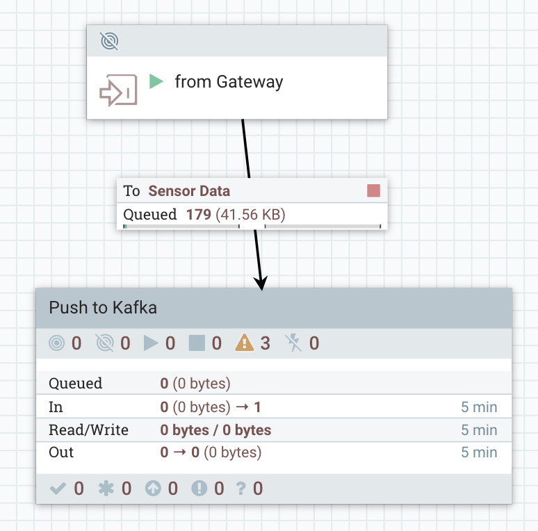

[[lab_3, Lab 3]]
== Lab 3 - Schema Registry

The data produced by the temperature sensors is described by a json schema. In this lab we will review this schema already registered in Schema Registry so that our flows in NiFi can refer to schema using an unified service. This will also allow us to evolve the schema in the future, if needed, keeping older versions under version control, so that existing flows and flowfiles will continue to work.

. In the Schema Registry Web UI, click the *SensorReading* record in the list to expand the properties. Make sure following configuration is setup:
+
[source]
----
Name:          SensorReading
Type:          Avro
Group:         Kafka
----
+
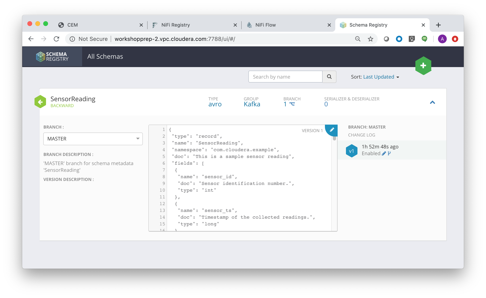

[[lab_4, Lab 4]]
== Lab 4 - Configuring the NiFi flow and pushing data to Kafka

In this lab, you will create a NiFi flow to receive the data from all gateways and push it to **Kafka**.

=== Versioning Process Group

Before we start building our flow, let's review a Process Group already created to help organizing the flows in the NiFi canvas and also to enable flow version control.

. To enable version control, right-click on the _Push to Kafka_ process group and select *Version > Start version control*.
+
image::images/start_pg_versioning.png[width=800]
+

When prompted, enter the details below:
+
[source]
----
Registry:  NiFi Registry
Bucket:    SensorFlows
Flow Name: SensorProcessGroup
----
+
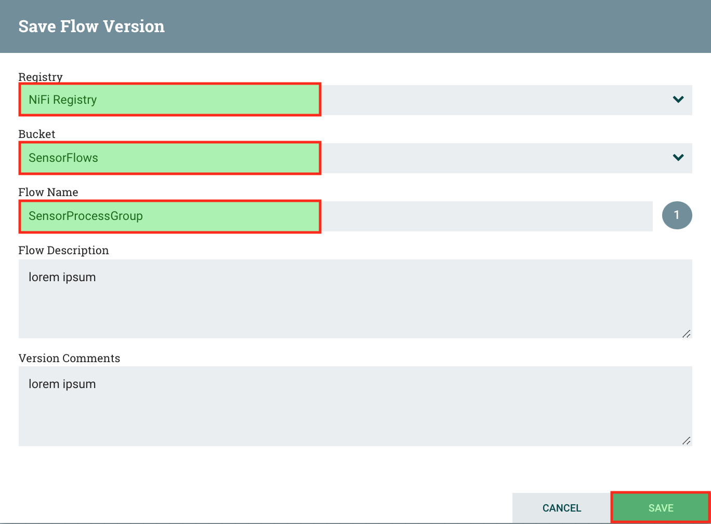
+

Once you complete, a image:images/version_control_tick.png[width=20] will appear on the Process Group, indicating that version control is now enabled for it.
+
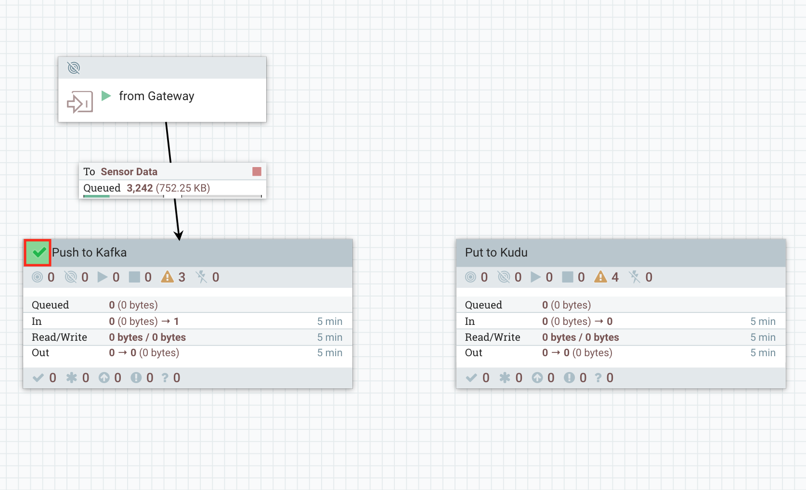
+

=== Creating the flow

. Double-click on the _Push to Kafka_ process group to expand it.
+
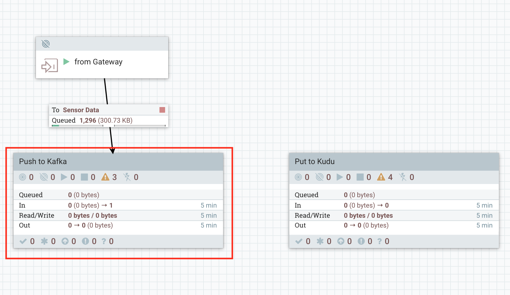

. You will see that the Process Group is already pre-configured with one _Input Port_ and two _Processors_. Do not care about the warning signs, we still need to make some configurations. Take a look in the bottom of the canvas. A link allows you to go back to the main canvas.
+
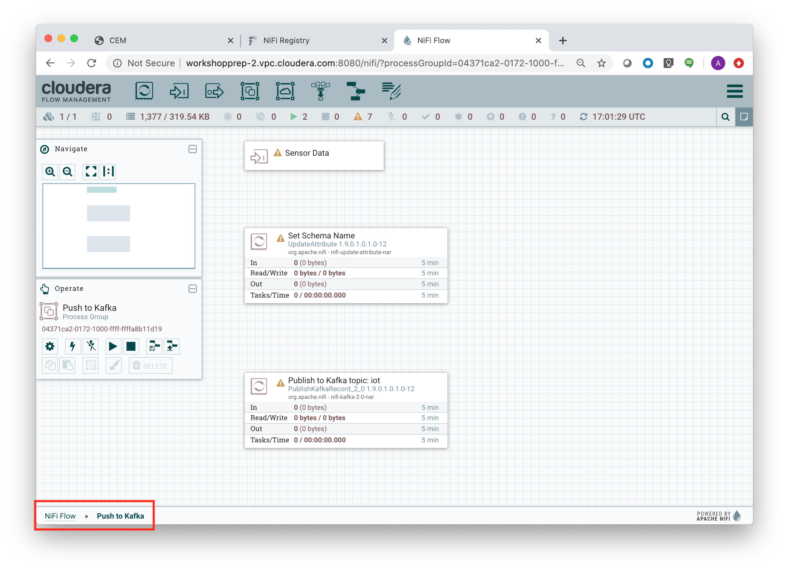
+

. Connect the *Sensor Data* input port to the *Set Schema Name* processor. Start the *Sensor Data* input port.
+
Remember you can see flow queue any time. Refresh the screen (`Ctrl+R` on Linux/Windows; `Cmd+R` on Mac) and you should see that the records that were queued on the "*Sensor Data*" Input Port disappeared. They flowed into the *Set Schema Name* processor.
+
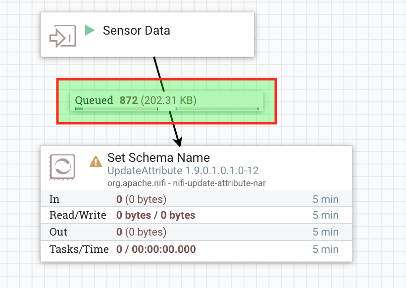
+
. Double-click the _Set Schema Name_ processor and configure it as follows:
+
.. In the _PROPERTIES_ tab:
** Click on the image:images/plus_button.png[width=25] button and add the following property:
+
[source]
----
Property Name:  schema.name
Property Value: SensorReading
----
.. Click *Apply*

. Connect the *Set Schema Name* processor to the *Publish to Kafka topic: iot* processor. Start *Set Schema Name* processor.

. Double-click the  _Publish to Kafka topic: iot_ processor and configure it as follows:

+
*PROPERTIES* tab:
+
[source]
----
Kafka Brokers:                         edge2ai-1.dim.local:9092
Topic Name:                            iot
Record Reader:                         JsonTreeReader
Record Writer:                         JsonRecordSetWriter
Use Transactions:                      false
Attributes to Send as Headers (Regex): schema.*
client.id                              nifi-sensor-data
----
+
`client.id` will help us clearly identify who is producing data into the Kafka topic.

. Add a  _Funnel_ to the canvas and connect the PublishKafkaRecord processor to it. When the "Create connection" dialog appears, select "*failure*" and click *Add*.
+
image::images/add_kafka_failure_connection.png[width=600]

. Double-click on the *Publish to Kafka topic: iot* processor, go to the *SETTINGS* tab, make sure the "*success*" relationship is checked in the *AUTOMATICALLY TERMINATED RELATIONSHIPS* section. Click *Apply*.
+
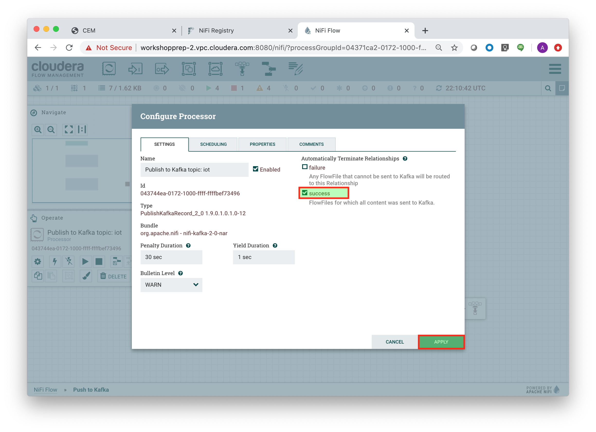

. Start *Publish to Kafka topic: iot* processor. Your canvas should now look like the one below:
+
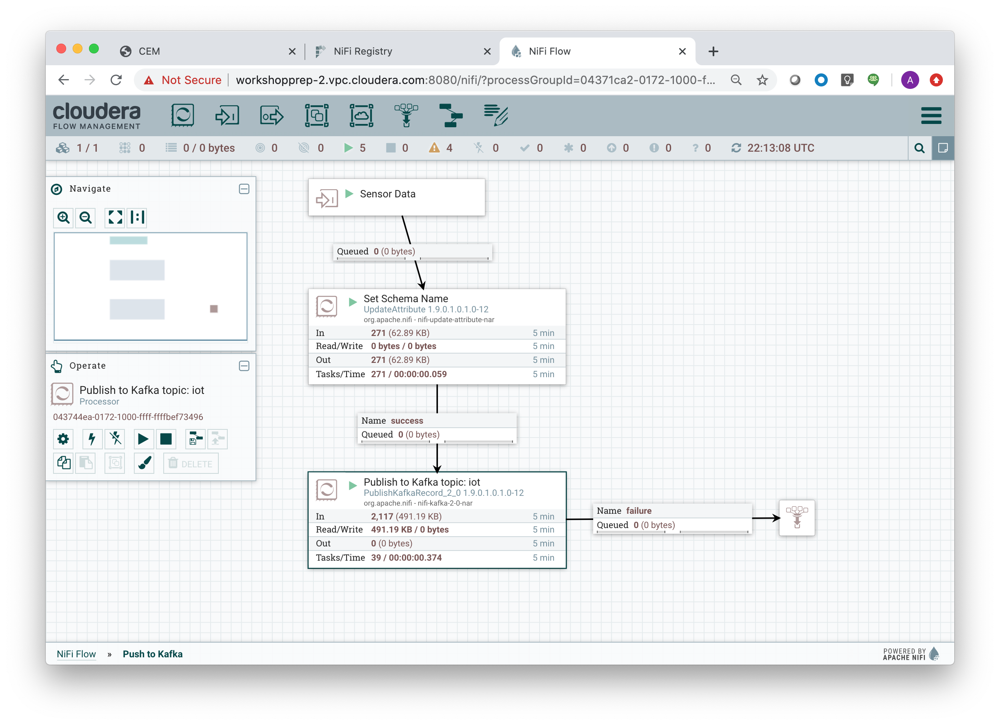
+
Take a look at the _PublishKafkaRecord_ processor. You should ee those records processed and pushed to Kafka, and there should be no records queued on the "failure" output queue.
+
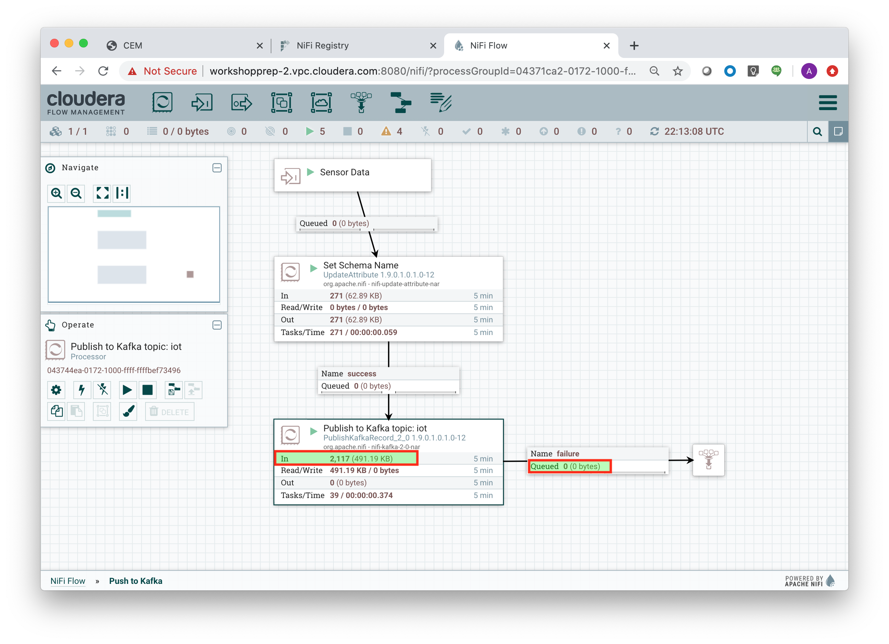
+

. Go back to the root canvas by clicking on the *NiFi Flow* link on the status bar.
+
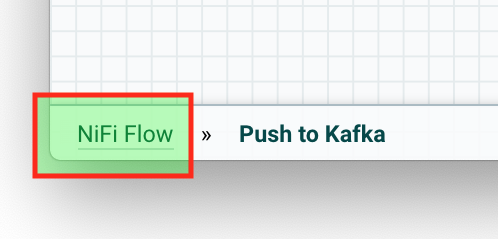

+
At this point, the messages are already in the Kafka topic. You can add more processors as needed to process, split, duplicate or re-route your FlowFiles to all other destinations and processors.

. To complete this Lab, let's commit and version the work we've just done. Right-click on the *Push to Kafka* Process Group in the main canvas and select *Version > Commit local changes*. Enter a descriptive comment and save.

[[lab_5, Lab 5]]
== Lab 5 - Use SMM to confirm that the data is flowing correctly

Now that our NiFi flow is pushing data to Kafka, it would be good to have a confirmation that everything is running as expected. In this lab you will use Streams Messaging Manager (SMM) to check and monitor Kafka.

. Start the *NiFi ExecuteProcess* simulator again and confirm you can see the messages queued in NiFi. Leave it running.

. Go to the Stream Messaging Manager (SMM) Web UI and familiarize yourself with the options there. Notice the filters (blue boxes) at the top of the screen.
+
image::images/smm.png[width=800]

. Click on the *Producers* filter and select only the *`nifi-sensor-data`* producer. This will hide all the irrelevant topics and show only the ones that producer is writing to.

. If you filter by *Topic* instead and select the `iot` topic, you'll be able to see all the *producers* and *consumers* that are writing to and reading from it, respectively. Since we haven't implemented any consumers yet, the consumer list should be empty.

. Click on the topic to explore its details. You can see more details, metrics and the break down per partition. Click on one of the partitions and you'll see additional information and which producers and consumers interact with that partition.
+
image::images/producers.png[width=800]

. Click on the *EXPLORE* link to visualize the data in a particular partition. Confirm that there's data in the Kafka topic and it looks like the JSON produced by the sensor simulator.
+
image::images/explore_partition.png[width=800]

. Check the data from the partition. You'll notice something odd. These are readings from temperature sensors and we don't expect any of the sensors to measure temperatures greater than 150 degrees in the conditions they are used. It seems, though, that `sensor_0` and `sensor_1` are intermittently producing noise and some of the measurements have very high values for these measurements.
+
image::images/troubled_sensors.png[width=800]

. In the next Lab we'll eliminate with these problematic measurements to avoid problems later in our data flow.

[[lab_6, Lab 6]]
== Lab 6 - Update the edge flows to perform additional processing on the data

In the previous lab we noticed that some of the sensors were sending erroneous measurements intermittently. If we let these measurements to be processed by our data flow we might have problems with the quality of our flow output and we want to avoid that.

We could use our *Process Sensor Data* flow in NiFi to filter out those problematic measurements. However, if their volume is large we could be wasting network bandwidth and causing additional overhead in NiFi to process the bogus data. What we'd like to do instead is to push additional logic to the edge to identify and filter those problems in place and avoiding sending them to NiFi in the first place.

We've noticed that the problem always happen with the temperatures in measurements `sensor_0` and `sensor_1`, only. If any of these two temperatures are *greater than 500* we *must discard* the entire sensor reading. If both of these temperatures are in the normal range (< 500) we can guarantee that all temperatures reported are correct and can be sent to NiFi.

. Go to the CEM Web UI. You may noticed that are two processors we are not using. Let's update the MiNiFi flow to filter that noisy data.
+
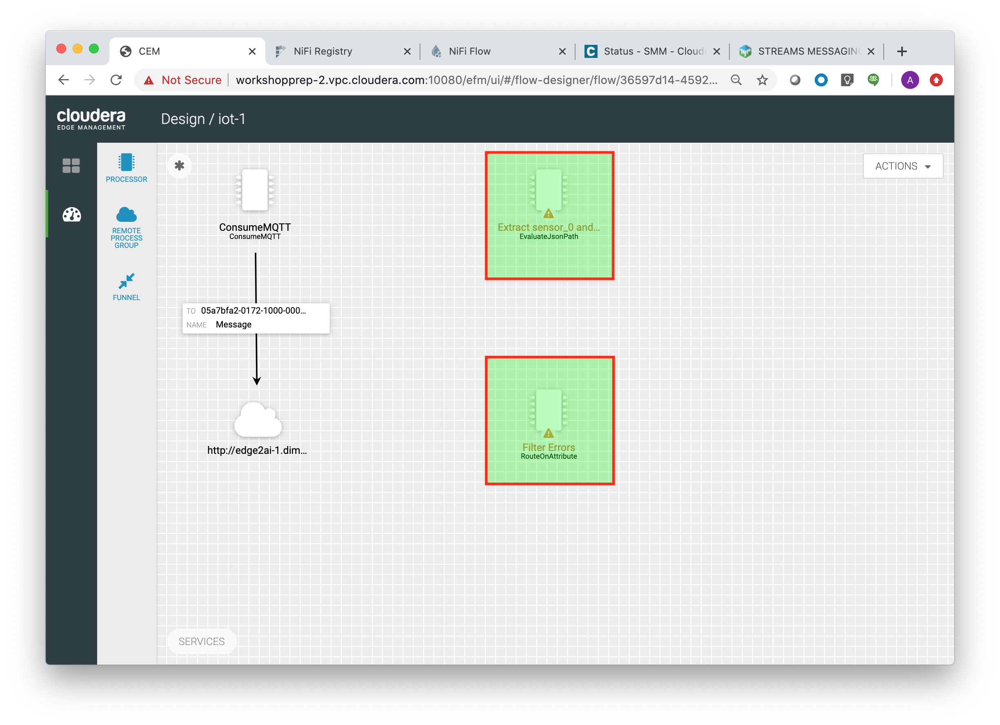

.. *Extract sensor_0 and sensor1 values*: will extract the value of the attribute we want to filter.
.. *Extract sensor_0 and sensor1 values*: will evaluate a regular expression to filter the data value we want to filter.

. Reconnect the _ConsumeMQTT_ processor to the _Extract sensor_0 and sensor1 values_ processor (top right processor in the canvas):
.. Click on the existing connection between _ConsumeMQTT_ and the _RPG_ to select it.
.. Drag the destination end of the connection to the _Extract sensor_0 and sensor1 values_ processor.
+
image::images/reconnect_consume_mqtt.png[width=800]
+
NOTE: In case you cannot reconnect, delete the current connection (right-click and Delete) and then make a new connection.
+
. Connect the _Extract sensor_0 and sensor1 values_ to the _Filter errors_ processor  (bottom  right processor in the canvas). When the *Create Connection* dialog appear, select "*matched*" and click *Create*.
+
image::images/connect_extract_to_route.png[width-800]

+
image::images/create_connection.png[width=800]

. Double-click the _Extract sensor_0 and sensor1 values_ and make sure the following values in the *AUTOMATICALLY TERMINATED RELATIONSHIPS* section and click *Apply*:
** failure
** unmatched
** sensor_0
** sensor_1

+
image::images/terminations.png[width=800]
+
. Before creating the last connection, you will need (again) the ID of the NiFi _Input Port_. Go to the NiFi Web UI , double-click on the "*from Gateway*" _Input Port_ and copy its ID.
+
image::images/input_port_id.png[width=800]

. Back on the CEM Web UI, connect the _Filter errors_ processor to the RPG:
+
image::images/connect_filter_ro_rpg.png[width=800]

. In the *Create Connection* dialog, check the "*unmatched*" checkbox and enter the copied input port ID, and click on *Create*:
+
image::images/create_last_connection.png[width=800]

. To ignore the errors, double-click on the _Filter errors_ processor, check the *error* checkbox under the *AUTOMATICALLY TERMINATED RELATIONSHIPS* section and click *Apply*:
+
image::images/terminate_errors.png[width=800]

. Finally, click on *ACTIONS > Publish...* on the CEM canvas, enter a descriptive comment like "Added filtering of erroneous readings" and click *Publish*.

. Make sure _Generate Test Data_ processor in NiFi is running.

. Go to the NiFi Web UI and confirm that the data is flowing without errors within the *Process Sensor Data* process group. Refresh a few times and check that the numbers are changing.

. Use the *EXPLORE* feature on the SMM Web UI to confirm that the bogus readings have been filtered out.

[[lab_7, Lab 7]]
== Lab 7 - Use NiFi to call the CDSW model endpoint and save to Kudu

In this lab, you will use NiFi to consume the Kafka messages containing the IoT data we ingested in the previous lab, call a CDSW model API endpoint to predict whether the machine where the readings came from is likely to break or not.

In preparation for the workshop we trained and deployed a Machine Learning model on the Cloudera Data Science Workbench (CDSW) running on your cluster. The model API can take a feature vector with the reading for the 12 temperature readings provided by the sensor and predict, based on that vector, if the machine is likely to break or not.

=== Configure the flow

. Double-click on the _Push to Kudu_ process group to expand it.
+
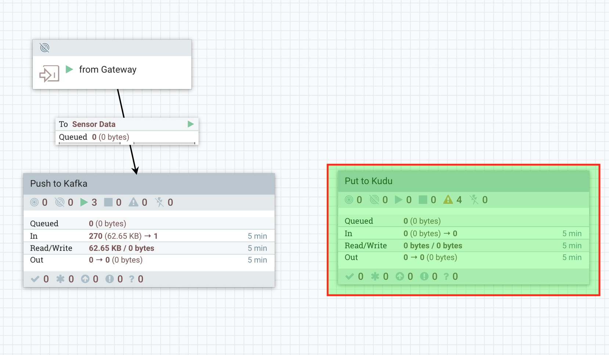

. You will see that the Process Group is already pre-configured with four Processors and one Funnel. Do not care about the warning signs, we still need to make some configurations.
+
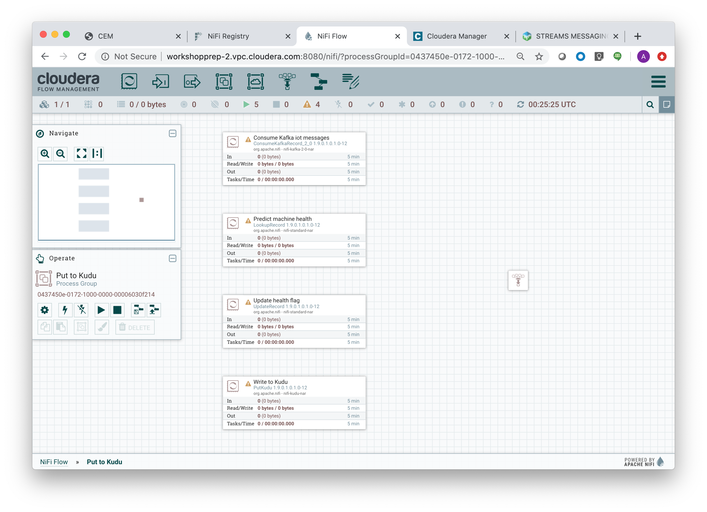
+
. Now we'll finish flow configuration to read the sensor data from Kafka, execute a model prediction for each of them and write the results to Kudu. At the end of this section you flow should look like the one below:

image::images/from_kafka_to_kudu_flow.png[width=800]

==== Consume Kafka iot messages processor

This processor will consume the event already pushed to Kaffa from the previous labs.

. Double-click _Consume Kafka iot messages_ processor (first from top to bottom) and add missing configurations as shown below:
+
*PROPERTIES* tab:
+
[source]
----
Kafka Brokers:                        edge2ai-1.dim.local:9092
Topic Name(s):                        iot
Topic Name Format:                    names
Record Reader:                        JsonTreeReader - With schema identifier
Record Writer:                        JsonRecordSetWriter
Honor Transactions:                   false
Group ID:                             iot-sensor-consumer
Offset Reset:                         latest
Headers to Add as Attributes (Regex): schema.*
----
`iot-sensor-consumer` will help us to further identify consumers groups in SMM.

. Connect the *Consume Kafka iot messages* to the *Funnel*. When prompted, check the *parse.failure* relationship for this connection:
+
image:images/parse_failure_relationship.png[width=500]

==== Predict machine health processor

This processor will score each event using a Machine Learning model exposed as REST API in CDSW. Model will return a response, predicting if the machine is likely to break or not, based on temperature reading provided by the sensor.

. Double-click _Predict machine health_ processor (second from top to bottom) and make sure configurations are set as shown below:
+
*PROPERTIES* tab:
+
[source]
----
Record Reader:          JsonTreeReader - With schema identifier
Record Writer:          JsonRecordSetWriter
Lookup Service:         RestLookupService
Result RecordPath:      /response
Routing Strategy:       Route to 'success'
Record Result Contents: Insert Entire Record
mime.type:              toString('application/json', 'UTF-8')
request.body:           concat('{"accessKey":"', '${cdsw.access.key}', '","request":{"feature":"', /sensor_0, ', ', /sensor_1, ', ', /sensor_2, ', ', /sensor_3, ', ', /sensor_4, ', ', /sensor_5, ', ', /sensor_6, ', ', /sensor_7, ', ', /sensor_8, ', ', /sensor_9, ', ', /sensor_10, ', ', /sensor_11, '"}}')
request.method:         toString('post', 'UTF-8')
----

. Click *Close* to go back to the process group.

. Connect the *Consume Kafka iot messages* processor to the *Predict machine health* one. When prompted, check the *success* relationship for this connection.

. Connect the *Predict machine health* to the same _Funnel_. When prompted, check the *failure* relationship for this connection.

==== Update health flag processor

This processor will update flow _is_healthy_ attribute based on the scoring model response,

. Double-click _Update health flag_ processor (third from top to bottom) and add missing configurations as shown below:
+
*PROPERTIES* tab:
+
[source]
----
Record Reader:              JsonTreeReader - With schema identifier
Record Writer:              JsonRecordSetWriter
Replacement Value Strategy: Record Path Value
/is_healthy:                /response/result
----

. Connect the *Predict machine health* processor to the *Update health flag* one. When prompted, check the *success* relationship for this connection.

. Connect the *Update health flag* to the same _Funnel_. When prompted, check the *failure* relationship for this connection.

==== Write to Kudu processor

This processor will save event data with _health_ score to a Kudu table.

. Double-click _Write to Kudu_ processor (fourth from top to bottom) and add missing configurations as shown below:

. Add a *PutKudu* processor to the canvas and configure it as shown below:
+
*PROPERTIES* tab:
+
[source]
----
Kudu Masters:     edge2ai-1.dim.local:7051
Table Name:       impala::default.sensors
Record Reader:    JsonTreeReader - With schema identifier
----

. Connect the *Update health flag* processor to the *Write to Kudu* one. When prompted, check the *success* relationship for this connection.

. Connect the *Write to Kudu* to the same _Funnel_. When prompted, check the *failure* relationship for this connection.

. Double-click on the *Write to Kudu* processor, go to the *SETTINGS* tab, check the "*success*" relationship in the *AUTOMATICALLY TERMINATED RELATIONSHIPS* section. Click *Apply*.

. Your _Put to Kafka_ canvas now should have all four processors stopped.
+
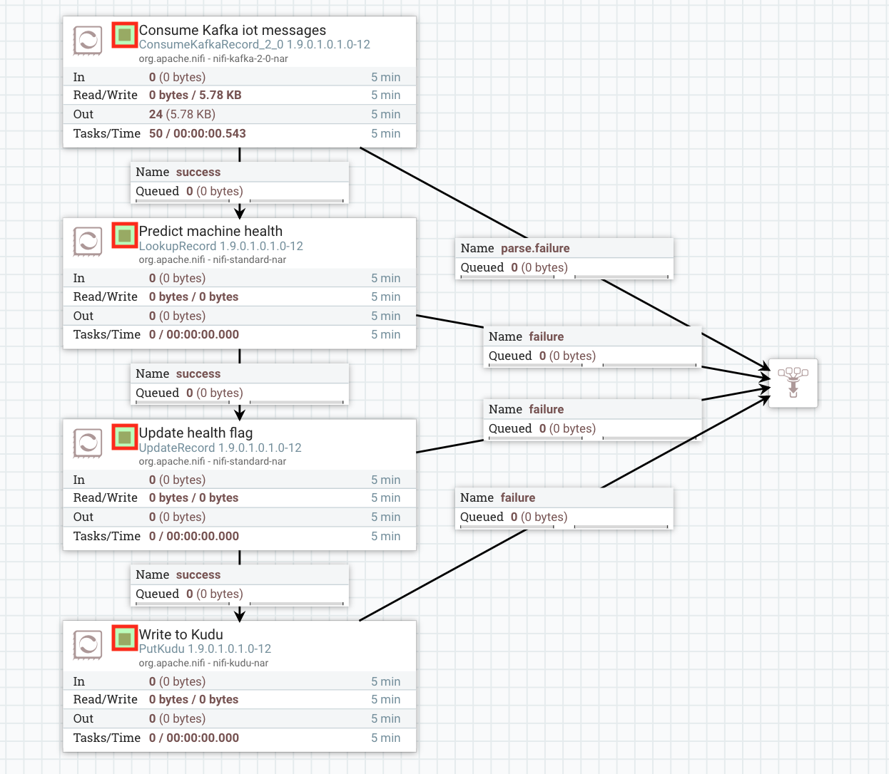
+
*DO NOT START ANY PROCESSOR YET. CONTINUE THE INSTRUCTIONS*

==== CDSW Access Key

When we added the *Predict machine health* above, you may have noticed that one of the properties (`request.body`) makes a reference to a variable called `cdsw.access.key`. This is an application key required to authenticate with the CDSW Model API when requesting predictions. So, we need to provide the key to the _LookupRecord_ processor by setting a variable with its value.

. Go to CDSW WEb UI and click in the _IoT Prediction Model_ project.

. To get the Access Key, go to the CDSW Web UI and click on *Models > Iot Prediction Model > Settings*. Copy the Access Key.
+
image::images/model_access_key.png[width=800]

. Go back to the NiFi Web UI, right-click on an empty area of the *Put to Kudu* canvas, and click on *Variables*.
+
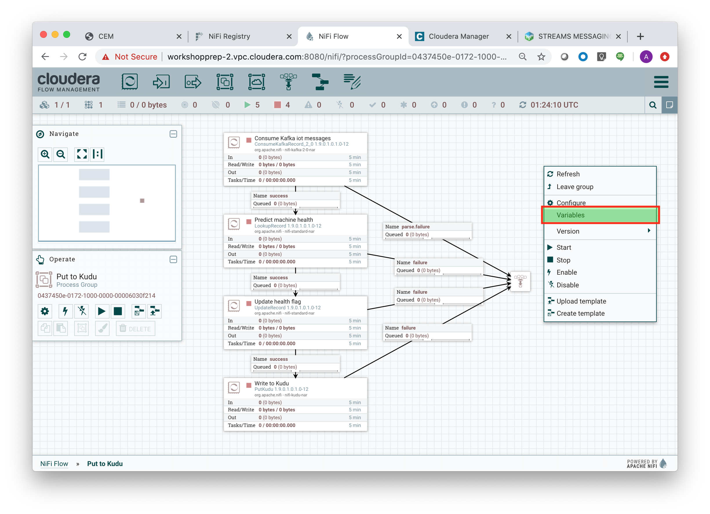

. Click on the _plus_ button (image:images/plus_button.png[width=25]) and add the following variable:
+
[source]
----
Variable Name:  cdsw.access.key
Variable Value: <key copied from CDSW>
----
+
image::images/access_key_variable.png[width=800]

. Click *Apply*

==== Create the Kudu table

. Go to the Hue Web UI and login. The first user to login to a Hue installation is automatically created and granted admin privileges in Hue.

. The Hue UI should open with the Impala Query Editor by default. If it doesn't, you can always find it by clicking on *Query button > Editor -> Impala*:
+
image::images/impala_editor.png[width=800]

. First, create the Kudu table. Login into Hue, and in the Impala Query, run this statement:
+
[source,sql]
----
CREATE TABLE sensors
(
 sensor_id INT,
 sensor_ts TIMESTAMP,
 sensor_0 DOUBLE,
 sensor_1 DOUBLE,
 sensor_2 DOUBLE,
 sensor_3 DOUBLE,
 sensor_4 DOUBLE,
 sensor_5 DOUBLE,
 sensor_6 DOUBLE,
 sensor_7 DOUBLE,
 sensor_8 DOUBLE,
 sensor_9 DOUBLE,
 sensor_10 DOUBLE,
 sensor_11 DOUBLE,
 is_healthy INT,
 PRIMARY KEY (sensor_ID, sensor_ts)
)
PARTITION BY HASH PARTITIONS 16
STORED AS KUDU
TBLPROPERTIES ('kudu.num_tablet_replicas' = '1');
----
+
image::images/create_table.png[width=800]

==== Running the flow

We're ready now to run and test our flow. Follow the steps below:

. Start all the processors in your flow.

. Refresh your NiFi page and you should see messages passing through your flow. The failure queues should have no records queued up.
+
image::images/kudu_success.png[width=800]

[[lab_8, Lab 8]]
== Lab 8 - Check the data on Kudu

In this lab, you will run some SQL queries using the Impala engine and verify that the Kudu table is being updated as expected.

. Login into Hue and run the following queries in the Impala Query Editor:
+
[source,sql]
----
SELECT count(*)
FROM sensors;
----
+
[source,sql]
----
SELECT *
FROM sensors
ORDER by sensor_ts DESC
LIMIT 100;
----

. Run the queries a few times \and verify that the number of sensor readings are increasing as the data is ingested into the Kudu table. This allows you to build real-time reports for fast action.
+
image::images/table_select.png[width=800]

== Congratulations

You have finished all the labs!!!

